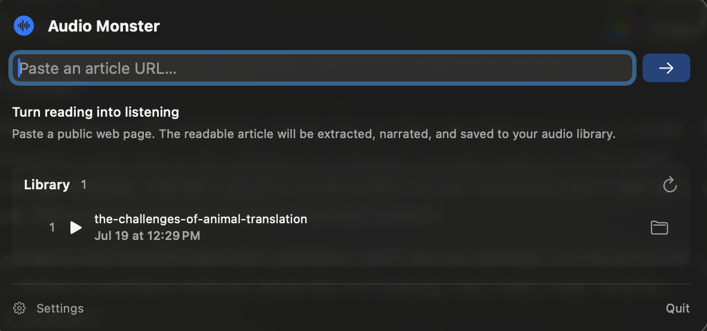

# Audio Monster

<p align="center">
  
</p>

[](https://github.com/wolfyy970/audio-monster/actions/workflows/ci.yml)
[](https://github.com/wolfyy970/audio-monster/releases/tag/v0.1.0)


[](LICENSE)

> [!IMPORTANT]
> **Audio Monster requires an Apple Silicon Mac (M1 or newer) running macOS 14
> or later.** Intel Macs are not supported because MLX and MLX Audio Swift are
> designed for Apple Silicon. There is no Intel or universal build.

<p align="center">
  
</p>

Audio Monster is a native macOS menu-bar app that turns web articles into
listenable audio. Paste a URL, press Return, and it extracts the readable text,
narrates it locally with Kokoro on Apple Silicon, and saves a sensibly named M4A
with the source URL embedded in its metadata.

The app is Swift from UI to inference. It uses
[Blaizzy/mlx-audio-swift](https://github.com/Blaizzy/mlx-audio-swift), MLX and
Metal for speech, Mozilla Readability inside Apple WebKit for article
extraction, and AVFoundation for playback and encoding. There is no Python,
Node.js, localhost server, `ffmpeg`, or cloud synthesis service.

> **Project status:** early preview. The native workflow is functional and
> extensively tested, and the maintainer release path is automated with
> Fastlane.

## Download

Download the latest signed and Apple-notarized build from
[GitHub Releases](https://github.com/wolfyy970/audio-monster/releases). Unzip it,
move **Audio Monster.app** to Applications, and launch it normally. Release ZIPs
include a SHA-256 checksum alongside the app.

Every Audio Monster release is ARM64-only for Apple Silicon. Building from
source remains available for contributors and anyone who prefers to inspect the
complete toolchain, but it does not add Intel compatibility.

## Highlights

- Native SwiftUI menu-bar experience with URL entry, cancellation, incremental
  section progress, and progressive playback.
- Pinned Mozilla Readability 0.6.0 extraction for normal and JavaScript-rendered
  pages, with a bounded semantic fallback.
- One warm `mlx-community/Kokoro-82M-bf16` model running through MLX Swift and
  Metal.
- All 54 Kokoro voices, grouped by gender and language, with automatically
  prepared 10-second previews and selection autoplay.
- Pitch-preserving playback from 0.2× to 3× in Settings, the active conversion,
  and the saved-file library.
- High-quality M4A output with title-based collision-safe filenames.
- The submitted and final redirected URLs retained in app data, with the source
  URL written to M4A metadata and Finder's “Where from” metadata.
- App-owned iCloud Documents storage when available, a local Application
  Support fallback, and a security-scoped custom-folder option.
- A dependency-free `AudioMonsterCore` Swift package boundary for future iPhone,
  iPad, web-service, or alternative client work.

## Requirements

- Apple Silicon Mac (M1 or newer; Intel is unsupported)
- macOS 14 or later
- Xcode with the Metal Toolchain installed
- Swift 6.2 or later

Audio Monster has no Python or external encoder requirement. The first
synthesis requires internet access to download the Kokoro model from Hugging
Face; subsequent use reuses the SDK's local model cache. Article extraction
also requires access to the URL the user submits.

## Build and run

```sh
make setup
make dev
```

`make dev` builds an ad-hoc-signed app, installs it under `dist/`, and launches
it. Ad-hoc builds cannot use the registered iCloud container, so they fall back
to `~/Library/Application Support/Audio Monster/Library` unless a custom folder
is selected.

For a release configuration without launching:

```sh
make build-app
```

Quit a copy running from `dist/` before replacing it. The build script refuses
to overwrite a live app bundle so that a terminating older process cannot
invalidate the new signature.

Fastlane is pinned through Bundler and provides repeatable build and release
lanes:

```sh
bundle install
bundle exec fastlane mac build
bundle exec fastlane mac verify
```

## Using the app

1. Click the monster in the menu bar.
2. Paste a public `http://` or `https://` article URL and press Return.
3. Listen as completed sections become available, or wait for the saved M4A.
4. Open Settings to choose and preview a voice, set playback speed and autoplay,
   or select a save folder.
5. Play completed files from the library or reveal them in Finder.

Some sites block automated navigation, require authentication, impose rate
limits, or expose too little readable text. Audio Monster reports those
failures instead of sending the article to a third-party extraction service.

## Storage and privacy

The recommended signed configuration saves completed files to `Documents`
inside `iCloud.org.audiomonster.AudioMonster`. That is a user-visible iCloud
Documents container—not a Music folder—and lets future Apple-platform clients
share the same completed artifacts.

When iCloud is unavailable or the build is not provisioned, Audio Monster uses
its local Application Support library. A folder selected in Settings takes
precedence through a security-scoped bookmark. Text and speech inference remain
on the Mac; normal network traffic is limited to the submitted page, its page
resources, and SDK-managed model downloads.

See [iCloud storage and distribution](docs/icloud.md) for the exact resolution,
coordination, signing, and fallback behavior.

## Architecture

The desktop app uses protocols and value types to separate UI orchestration,
rendered-page extraction, synthesis, playback, metadata, and storage. It does
not run a server inside the application. A future hosted converter can implement
the same engine boundary as a separate deployment without complicating the
local client.

Read the [architecture](docs/architecture.md) and the
[article-extraction decision](docs/extraction-research.md) for the design and
tradeoffs. Native TTS benchmark methodology and results live under
[`benchmarks/swift-tts`](benchmarks/swift-tts/README.md).

## Testing and quality gates

```sh
make test              # macOS app and shared-core tests
make test-benchmark    # benchmark-analysis tests
make format-check      # Swift formatting and static boundaries
make verify            # complete release-quality local gate
```

The suites exercise URL validation, rendered extraction fixtures, extractor
integrity, chunking, the voice catalog, preview batching and cancellation,
audio metadata, storage and iCloud decisions, playback lifecycle and speed,
library scanning, and the app-model flow with native fakes. An opt-in live URL
test is available for local diagnostics:

```sh
AUDIO_MONSTER_LIVE_WEB_TEST=1 make test
```

The complete gate also builds an ad-hoc-signed release app and verifies its
bundle metadata, signature, icons, MLX Metal library, pinned Readability assets,
SDK revision, portable paths, and absence of legacy runtime payloads.

## Developer ID builds

Signing credentials and provisioning profiles must stay outside the repository.
To produce the iCloud-enabled Developer ID build:

```sh
AUDIO_MONSTER_SIGNING_IDENTITY='Developer ID Application: …' \
AUDIO_MONSTER_PROVISIONING_PROFILE='/path/to/profile.provisionprofile' \
bundle exec fastlane mac signed
```

The build derives the Apple Team ID from that profile and resolves the source
entitlement template at build time. Contributors do not need to edit or publish
their Team ID. Notarization is a separate release step and is not currently
performed by this lane. The `mac release` lane adds tests, notarization,
stapling, Gatekeeper validation, and a versioned ZIP with a SHA-256 checksum.
See [the release guide](docs/releasing.md) for authentication and draft GitHub
publication.

## Project layout

```text
apps/macos/             Swift package, app resources, and tests
benchmarks/swift-tts/   Reproducible native-model benchmark harness
docs/                   Architecture and platform decisions
fastlane/               Maintainer build, notarization, and release lanes
scripts/                Build and verification entry points
```

## Contributing

See [CONTRIBUTING.md](CONTRIBUTING.md) before opening a substantial change.
Participation is governed by the [Code of Conduct](CODE_OF_CONDUCT.md). Please
report suspected vulnerabilities according to [SECURITY.md](SECURITY.md).

User-visible changes are recorded in [CHANGELOG.md](CHANGELOG.md).

## License

Audio Monster is available under the [MIT License](LICENSE). Bundled and
downloaded components retain their own terms; see
[THIRD_PARTY_NOTICES.md](THIRD_PARTY_NOTICES.md).

## Disclosure

**Audio Monster was vibe-coded with intent.** It was developed through close
human–AI collaboration, with human judgment retained at every consequential
step. AI accelerated implementation; it did not replace engineering
responsibility.

“With intent” means the work did not stop when generated code appeared to run.
The application was deliberately architected, reviewed, refactored, protected
by unit and integration tests and clean-build CI, audited for secrets and
vulnerable dependencies, and distributed through a signed and notarized release
process.

Vibe coding may describe how software begins, but it should never excuse how
software ships. The maintainers remain accountable for the result without
claiming perfection. Corrections and improvements are welcome.
