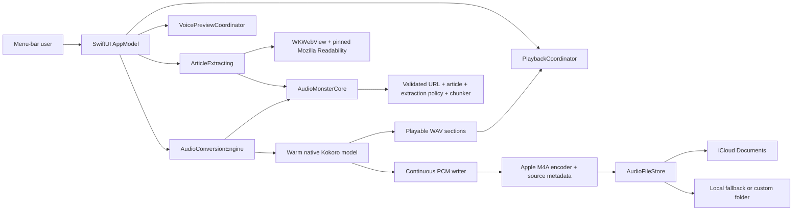

# Architecture

Audio Monster’s macOS conversion path is native Swift. Architectural separation is expressed through protocols and value models, not through a localhost process.

## Boundaries

### UI and orchestration

`AppModel` is the UI-facing facade for conversion, persistence, the saved-file library,
and iCloud identity changes. `PlaybackCoordinator` owns the mutually exclusive article,
library, and voice-sample player lifecycles. `VoicePreviewCoordinator` owns batching,
priority, autoplay intent, cache commits, and cancellation epochs. All three receive
protocol-backed adapters, so failure and race behavior is testable without networking,
model inference, or live audio playback.

### Shared core

`AudioMonsterCore` is a public SwiftPM library target for macOS and iOS. It contains
only Foundation-backed validated article URLs, readable article provenance, text
chunking/filename policy, and browser snapshot stability policy. It has no package
dependency and cannot import AppKit, SwiftUI, WebKit, AVFoundation, or MLX. The macOS
executable depends on the core; platform adapters depend in the opposite direction.

### Content extraction

`BrowserPageRenderer` loads the submitted URL in an off-screen `WKWebView`, waits through browser checkpoints and client rendering, and runs a pinned Mozilla Readability 0.6.0 resource against a cloned DOM in an isolated `WKContentWorld`. Readability is the extraction algorithm used by Firefox Reader View; it scores the messy structures found on real publishing sites instead of trusting `article` or `main` tags. A bounded semantic extractor remains as a fallback.

The renderer requires two matching readable snapshots before accepting a page, with a five-snapshot upper bound for articles containing live widgets. The result is plain normalized text only; Readability's returned HTML is never rendered. This avoids the script-injection concern associated with displaying unsanitized extracted markup. `ReadableArticle` retains the submitted URL, final redirect URL, title, and narration text.

Main-frame HTTP 4xx and 5xx responses—including rate limits such as 429—are rejected
by the WebKit navigation delegate before snapshot polling begins. Redirects,
successful responses, and failed subresources remain eligible so that one broken
image or analytics request cannot discard an otherwise readable article.

The vendored Apache-2.0 source, license, upstream commit, and SHA-256 live under `Sources/AudioMonster/Resources/Readability`. It runs locally in Apple WebKit—there is no Python, Node.js runtime, network service, or runtime script download. The `ArticleExtracting` protocol remains the seam for a later pure-Swift implementation. A future Swift port should be a separate SwiftPM package built on SwiftSoup and gated against Mozilla's fixture corpus rather than an untested one-shot rewrite.

### Speech engine

`NativeKokoroAudioEngine` is a Swift actor. It lazily loads one `KokoroModel` from the pinned `mlx-audio-swift` SDK, keeps it warm, and serializes access to MLX/Metal. Apple Silicon Macs expose one unified Metal device; running competing copies of this small model would increase memory pressure and contention rather than use separate GPUs.

The article is split into sections of at most 280 characters, safely below Kokoro’s 510-token input limit. Each completed section advances progress and becomes a local WAV playback item. Samples are also appended to one continuous PCM file without retaining the whole article waveform in memory. At completion, AVFoundation encodes that file once to M4A and embeds the article title and source URL.

Voice previews share the same warm engine and live in a model-and-prompt-versioned
Application Support cache. Missing previews are generated automatically through unique
staging files and atomically committed only after WAV/AVAudioFile validation. Article
work suspends the background batch, clears pending autoplay, takes priority, and resumes
missing previews afterwards; epoch checks prevent cancelled work from overwriting the
new cache state.

### Storage

`AudioFileStore` stages the completed M4A and adds Finder’s `kMDItemWhereFroms`
attribute. App-owned iCloud saves use `FileManager.setUbiquitous`; local and custom
folders use `NSFileCoordinator`. Before persistence begins, settings issue an opaque
reservation for the resolved destination. Folder changes are disabled until that
reservation is released, so an in-flight save cannot silently move between locations.
Changing the folder immediately invalidates the old library snapshot; playback and
Finder reveal operations verify the snapshot's folder identity before opening any
item, and security-scoped access is taken against the folder that was actually
scanned. No engine receives or retains access to the user’s destination folder.

## Future clients and hosted operation

The existing `AudioMonsterCore` target can be imported by an iOS client. More
Foundation-only workflow policy can move across the same compiler-enforced boundary as
it stabilizes. A hosted adapter can conform to `AudioConversionEngine` and translate the
same domain events to a remote job API. That adapter should be a deliberate deployment
component; it is not necessary or desirable as a server embedded inside the desktop app.

For a hosted service, add authentication, quotas, durable jobs, restricted egress, and object storage. Native clients should continue to own iCloud placement because a hosted backend cannot access a user’s private ubiquity container.

## Packaging

The build script invokes Xcode so the MLX Metal library is compiled and copied into the app’s Resources directory with the other SwiftPM resource bundles. Release coverage instrumentation is disabled, C/C++ source paths are prefix-mapped, and local symbols are stripped before signing. It fails packaging if the pinned Readability resource is absent. The verifier also rejects personal absolute build paths. The bundle contains no Python environment, server source, Node.js runtime, `uv`, or external encoder. Distribution still requires a Developer ID or App Store signature, notarization where applicable, and production iCloud entitlements.
