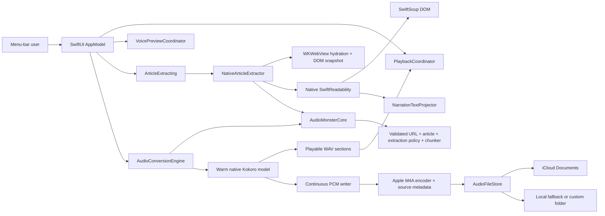

# Architecture

Audio Monster’s macOS conversion path is native Swift. Architectural separation is expressed through protocols and value models, not through a localhost process.

## Boundaries

### UI and orchestration

`AppModel` is the UI-facing facade for conversion, persistence, the saved-file library,
and iCloud identity changes. `PlaybackCoordinator` owns the mutually exclusive article,
library, and voice-sample player lifecycles. `VoicePreviewCoordinator` owns batching,
priority, autoplay intent, cache commits, and cancellation epochs. All three receive
protocol-backed adapters, so failure and race behavior is testable without networking,
model inference, or live audio playback.

### Shared core

`AudioMonsterCore` is a public SwiftPM library target for macOS and iOS. It contains
only Foundation-backed validated article URLs, readable article provenance, text
chunking/filename policy, and browser snapshot stability policy. It has no package
dependency and cannot import AppKit, SwiftUI, WebKit, AVFoundation, or MLX. The macOS
executable depends on the core; platform adapters depend in the opposite direction.

### Content extraction

`NativeArticleExtractor` composes three deliberately separate services. First,
`BrowserPageRenderer` loads the submitted URL in an off-screen `WKWebView` and
waits for client-side rendering. A small, compiled-in bridge first returns typed,
HTML-free readiness probes containing challenge, URL, title, total-text,
prose-shaped-text, and stability signals. Only after that signal settles does
Swift request one bounded clone of the rendered DOM. The transport clone removes
only non-JSON-LD scripts, style elements, and comments; JSON-LD, `noscript` image
fallbacks, metadata, attributes, and content remain available to native
Readability. The bridge does not select content and does not contain Mozilla
Readability. Some JavaScript is unavoidable at this WebKit boundary because
Apple exposes no Swift API for serializing a live DOM; all article interpretation
remains native.

The renderer accepts two matching compact fingerprints, with a five-probe upper
bound for pages containing live widgets. The fingerprint combines the resolved
URL, title, semantic shape, and non-interface prose signal, so a stable navigation
or consent shell cannot pre-empt a slower client-rendered article. The final DOM
is serialized once and its signal is checked again before acceptance; the app
never retains two multi-megabyte HTML snapshots. Browser verification challenges
are returned as a distinct state and rejected before article parsing.

Second, `SwiftReadabilityArticleParser` creates a fresh native Readability
session off the main actor. The package is pinned by immutable revision, uses
SwiftSoup 2.13.6, and treats Mozilla Readability commit
[`ab4027a8b37669745016869a37a504727992b2ba`](https://github.com/mozilla/readability/commit/ab4027a8b37669745016869a37a504727992b2ba)
as its behavioral specification. Default mode matches Mozilla across all observable
fields on 136/136 compatibility inputs. Audio Monster owns and explicitly
composes the granular publisher-chrome, carousel, media, article-body, and ruby
extensions at its parser boundary; SwiftReadability contains no app-specific
preset, and those additions cannot alter the package's default Mozilla contract.

Third, `NarrationTextProjector` converts the extracted HTML to speech-oriented
plain text. Readability's opt-in cleanup removes publisher chrome before this
stage; the projector then preserves every selected heading, paragraph, list,
quotation, preformatted block, line break, CJK passage, navigation landmark,
aside, and footer while excluding controls, hidden content, and ruby
pronunciation hints. Extracted HTML is never rendered. `ReadableArticle` retains
the submitted URL, final redirect URL, title, and narration text.

Main-frame HTTP 4xx and 5xx responses—including rate limits such as 429—are rejected
by the WebKit navigation delegate before snapshot polling begins. Redirects,
successful responses, and failed subresources remain eligible so that one broken
image or analytics request cannot discard an otherwise readable article.

The `RenderedPageRendering`, `ArticleParsing`, and `ArticleExtracting` protocols
let a future iOS client replace the desktop browser adapter, or a hosted service
supply fetched HTML, without coupling transport to content selection. There is
no Python, Node.js runtime, localhost service, runtime script download, or
bundled JavaScript extraction resource.

### Speech engine

`NativeKokoroAudioEngine` is a Swift actor. It lazily loads one `KokoroModel` from the pinned `mlx-audio-swift` SDK, keeps it warm, and serializes access to MLX/Metal. Apple Silicon Macs expose one unified Metal device; running competing copies of this small model would increase memory pressure and contention rather than use separate GPUs.

The article is split into sections of at most 280 characters, safely below Kokoro’s 510-token input limit. Each completed section advances progress and becomes a local WAV playback item. Samples are also appended to one continuous PCM file without retaining the whole article waveform in memory. At completion, AVFoundation encodes that file once to M4A and embeds the article title and source URL.

Voice previews share the same warm engine and live in a model-and-prompt-versioned
Application Support cache. Missing previews are generated automatically through unique
staging files and atomically committed only after WAV/AVAudioFile validation. Article
work suspends the background batch, clears pending autoplay, takes priority, and resumes
missing previews afterwards; epoch checks prevent cancelled work from overwriting the
new cache state.

### Storage

`AudioFileStore` stages the completed M4A and adds Finder’s `kMDItemWhereFroms`
attribute. App-owned iCloud saves use `FileManager.setUbiquitous`; local and custom
folders use `NSFileCoordinator`. Before persistence begins, settings issue an opaque
reservation for the resolved destination. Folder changes are disabled until that
reservation is released, so an in-flight save cannot silently move between locations.
Changing the folder immediately invalidates the old library snapshot; playback and
Finder reveal operations verify the snapshot's folder identity before opening any
item, and security-scoped access is taken against the folder that was actually
scanned. No engine receives or retains access to the user’s destination folder.

## Future clients and hosted operation

The existing `AudioMonsterCore` target can be imported by an iOS client. More
Foundation-only workflow policy can move across the same compiler-enforced boundary as
it stabilizes. A hosted adapter can conform to `AudioConversionEngine` and translate the
same domain events to a remote job API. That adapter should be a deliberate deployment
component; it is not necessary or desirable as a server embedded inside the desktop app.

For a hosted service, add authentication, quotas, durable jobs, restricted egress, and object storage. Native clients should continue to own iCloud placement because a hosted backend cannot access a user’s private ubiquity container.

## Packaging

The build script invokes Xcode with versions restricted to `Package.resolved` so
the MLX Metal library and exact native dependencies are compiled reproducibly.
Release coverage instrumentation is disabled, C/C++ source paths are
prefix-mapped, and local symbols are stripped before signing. Packaging fails
if legacy `Readability.js` or `Snapshot.js` appears, if dependency revisions
move, or if the app contains personal paths, Python, Node, server, or external
encoder payloads. Exact license and notice files from the complete resolved
SwiftPM checkout graph are copied into the app and verified byte for byte.
Distribution still requires a Developer ID or App Store signature,
notarization, and production iCloud entitlements.
